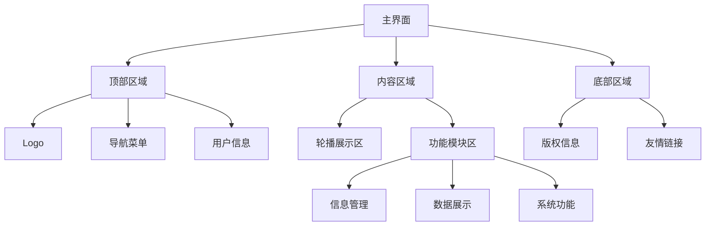

# 用户主界面开发方案

## 1. 界面布局设计



## 2. 功能模块划分

### 2.1 顶部区域

- Logo 展示
- 主导航菜单
- 用户信息/登录入口
- 搜索功能

### 2.2 内容区域

- 轮播展示区：展示重要信息或公告
- 信息管理模块：个人信息维护、用户管理等
- 数据展示模块：各类数据可视化展示
- 系统功能模块：各项核心功能入口

### 2.3 底部区域

- 版权信息
- 友情链接
- 联系方式

## 3. 技术实现方案

### 3.1 目录结构

```
src/
├── layouts/                # 布局组件
│   ├── MainLayout.vue     # 主布局
│   ├── HeaderSection.vue  # 顶部区域
│   └── FooterSection.vue  # 底部区域
├── components/            # 公共组件
│   ├── Carousel.vue      # 轮播组件
│   └── ModuleCard.vue    # 模块卡片组件
├── views/                # 页面组件
│   └── Home.vue         # 主页面
└── stores/               # 状态管理
    └── layout.js        # 布局相关状态
```

### 3.2 使用的主要技术和组件

- Element Plus 组件：
  - `el-container`: 整体布局
  - `el-header`: 顶部区域
  - `el-main`: 内容区域
  - `el-footer`: 底部区域
  - `el-carousel`: 轮播展示
  - `el-card`: 模块展示卡片

### 3.3 响应式设计

- 使用 Element Plus 的响应式类
- 自定义媒体查询断点
- Flex/Grid 布局实现模块自适应

## 4. 开发步骤

1. 创建基础布局组件
2. 实现顶部导航和用户信息展示
3. 开发轮播展示组件
4. 实现功能模块卡片组件
5. 整合所有组件到主页面
6. 添加响应式样式
7. 实现路由配置
8. 对接后端 API

## 5. 注意事项

1. 遵循 Vue 3 组件最佳实践
2. 使用 Composition API 开发
3. 确保良好的性能优化
4. 实现合理的错误处理
5. 保持代码可维护性
