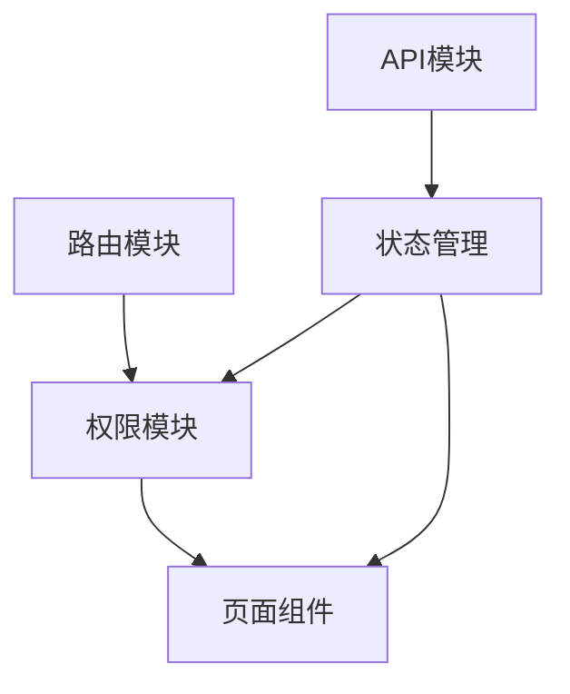
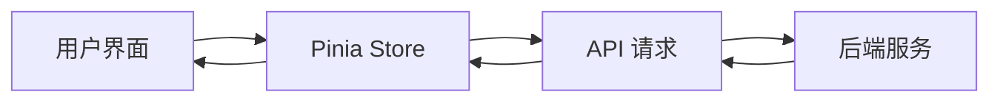

# 开发文档

## 1. 项目概述

本项目是一个基于 Vue 3 + Vite 的前端项目，作为全栈练手项目的前端部分。项目采用前后端分离架构，前端使用 Vue 3 生态系统开发，后端采用 Spring Boot 3.x 提供 RESTful API 服务。

### 应用场景

- 企业级后台管理系统
- 数据可视化展示平台
- 用户权限管理系统

## 2. 技术栈

### 前端技术

| 技术         | 版本 | 说明                               |
| ------------ | ---- | ---------------------------------- |
| Vue 3        | 3.x  | 前端核心框架，采用 Composition API |
| Vite         | 4.x  | 现代化构建工具，提供快速的开发体验 |
| Pinia        | 2.x  | 新一代状态管理工具，替代 Vuex      |
| Vue Router   | 4.x  | Vue 官方路由管理器                 |
| Element Plus | 2.x  | 基于 Vue 3 的组件库                |
| Axios        | 1.x  | HTTP 请求客户端                    |

### 后端技术

| 技术        | 版本 | 说明         |
| ----------- | ---- | ------------ |
| Spring Boot | 3.x  | 后端开发框架 |
| MySQL       | 8.x  | 关系型数据库 |
| MyBatis     | -    | ORM 框架     |

## 3. 功能模块

### 用户认证模块

- 🚧 用户注册
- 🚧 用户登录
- 🚧 Token 认证
- 🚧 密码重置

### 信息管理模块

- 🚧 个人信息维护
- 🚧 用户管理
- 🚧 角色管理
- 🚧 部门管理

### 数据展示模块

- ✅ 基础布局搭建
- 🚧 数据表格（CRUD）
- 🚧 数据可视化
- 🚧 Excel 导入导出

### 权限控制模块

- 🚧 动态路由
- 🚧 菜单权限
- 🚧 按钮权限
- 🚧 数据权限

### UI/UX 优化

- ✅ Element Plus 集成
- 🚧 主题定制
- 🚧 动画效果
- 🚧 响应式适配

## 4. 系统架构与模块划分

### 目录结构

```
frontend/
├── src/
│   ├── api/          # API 接口封装
│   ├── assets/       # 静态资源
│   ├── components/   # 公共组件
│   ├── router/       # 路由配置
│   ├── stores/       # Pinia 状态管理
│   ├── utils/        # 工具函数
│   ├── views/        # 页面组件
│   ├── App.vue       # 根组件
│   └── main.js       # 入口文件
├── public/           # 公共资源
└── vite.config.js    # Vite 配置
```

### 模块依赖关系



### 数据流向


